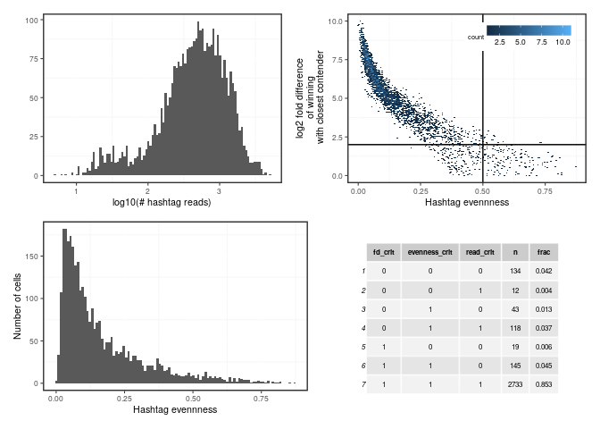

<!-- README.md is generated from README.Rmd. Please edit that file -->

# hashtagassign

<!-- badges: start -->
<!-- badges: end -->

The goal of hashtagassign is to …

## Installation

``` r
# install.packages("devtools")
devtools::install_github("slagtermaarten/hashtagassignment")
```

``` r
# library(hashtagassign)
data_dir <- '/DATA/users/m.slagter/MirjamHoekstra/raw_exp_5310'
hashtag_counts <- extract_hashtags_from_cellranger(data_dir = data_dir)
stats <- compute_hashtag_stats(hashtag_counts)

## Define thresholds
## Cells need the winning hash tag to be at least 2^2 (=4) times larger than the
## second best hash hag
fd_thresh = 2
## Cells can have a hashtag evenness of at most .5
evenness_thresh = .5
## Minimal amount of hash tag reads cells need to have
read_thresh = 100
```

Select cells to serve as examples for different levels of evenness (\[0,
.1, .2, …\]). Notice how the distributions get more fuzzy as evenness
increases.

``` r
hashtag_evenness_examples <- purrr::map_dfr(seq(0, 1, by = .1), function(e) {
  idx <- order((stats$hashtag_evenness - e)^2)[1:2]
  stats %>%
    { .[idx, ] } %>%
    dplyr::select(sample_id, 
                  matches('HTO|human_Hashtag'), hashtag_evenness, fd_cc)
  }) %>% 
  unique %>% 
  dplyr::rename_with(.fn = function(x) gsub('(HTO\\d+)_.*', '\\1', x)) %>%
  dplyr::rename_with(.fn = function(x) gsub('human_Hashtag', 'HTO', x)) %>%
  dplyr::mutate(hashtag_evenness = round(hashtag_evenness, 2)) %>%
  dplyr::mutate(fd_cc = round(fd_cc, 2)) %>%
  { . }

hashtag_evenness_examples$selected <-
  with(hashtag_evenness_examples, 
       is.na(fd_cc) | fd_cc >= fd_thresh,
       hashtag_evenness <= evenness_thresh)
knitr::kable(hashtag_evenness_examples)
```

| sample\_id       | HTO1 | HTO2 | HTO3 | HTO4 | HTO5 | HTO6 | HTO7 | hashtag\_evenness | fd\_cc | selected |
|:-----------------|-----:|-----:|-----:|-----:|-----:|-----:|-----:|------------------:|-------:|:---------|
| AGCGTCGGTACCGTCG |   25 |    0 |    0 |    0 |    0 |    0 |    0 |              0.00 |     NA | TRUE     |
| TTGCGTCGTACTCGAT |  187 |    0 |    0 |    0 |    0 |    0 |    0 |              0.00 |     NA | TRUE     |
| CATGCGGTCCGTCCTA |   10 |    3 |    1 |    0 |    4 |  565 |    2 |              0.10 |   5.69 | TRUE     |
| GGATCTACATTCACAG |   14 |    2 |    0 |    3 |    0 |  511 |    1 |              0.10 |   5.09 | TRUE     |
| AGGGAGTGTTCATCGA |   20 |    4 |    0 |    1 |    2 |  298 |    2 |              0.20 |   3.83 | TRUE     |
| GTGGTTAGTGAGTAAT |   10 |   12 |  407 |    1 |    2 |    5 |    4 |              0.20 |   4.97 | TRUE     |
| GATCGTAGTCGCTTGG |  109 |    1 |    1 |    3 |    1 |   14 |    0 |              0.30 |   2.87 | TRUE     |
| CACAGATTCAACTGGT |   47 |    4 |  391 |    2 |    9 |    6 |    1 |              0.30 |   3.03 | TRUE     |
| GATTGGTAGAACTCCT |   56 |    4 |    1 |  169 |    0 |    1 |    5 |              0.40 |   1.58 | FALSE    |
| ATGTCTTCACGTATAC |    7 |    3 |    1 |    0 |    0 |    0 |   33 |              0.40 |   2.09 | TRUE     |
| ATCGTAGAGAGCAGCT |   13 |    4 |    1 |   85 |    3 |    6 |    3 |              0.50 |   2.62 | TRUE     |
| TTTACTGCAACTGTGT |    6 |    3 |    0 |    3 |    1 |    0 |   31 |              0.50 |   2.19 | TRUE     |
| GTGCTGGCAGATGCGA |    6 |    0 |    1 |    0 |    2 |    2 |    0 |              0.60 |   1.22 | FALSE    |
| TTGATGGTCCATCGTC |  104 |    3 |   26 |    4 |  131 |    9 |    0 |              0.60 |   0.33 | FALSE    |
| ATCTTCAGTGGTACAG |   12 |    9 |    0 |    1 |    1 |    4 |    1 |              0.70 |   0.38 | FALSE    |
| AGGCCACAGTACAACA |    5 |    1 |    0 |    1 |    2 |    1 |    0 |              0.70 |   1.00 | FALSE    |
| CGAGTTACAGAACTCT |   21 |   17 |    2 |   19 |    1 |   11 |    1 |              0.80 |   0.14 | FALSE    |
| TCAAGCAAGAAACCAT |    7 |    2 |    0 |    1 |    1 |    3 |    2 |              0.79 |   1.00 | FALSE    |
| GTCATCCCAAATGCGG |    3 |    3 |    3 |    5 |    2 |    0 |    1 |              0.87 |   0.58 | FALSE    |
| AGGTCTAGTCGAAACG |    5 |    1 |    1 |    1 |    1 |    1 |    1 |              0.86 |     NA | TRUE     |

Create panel of plots to assess what kind and how many cells will be
filtered out

``` r
library(gridExtra)
library(ggplot2)
library(patchwork)

p1 <- stats$total_hashtag_reads %>% log10 %>% 
  qplot(bins = 100) + xlab('log10(# hashtag reads)')

p2 <- ggplot(mapping = aes(x = hashtag_evenness, y = fd_cc),
             data = stats) +
  geom_hex(bins = 150) +
  xlab('Hashtag evennness') +
  geom_hline(yintercept = fd_thresh) +
  geom_vline(xintercept = evenness_thresh) +
  ylab('log2 fold difference\n of winning\n with closest contender') +
  ggplot2::theme(legend.position = c(.95, .95), legend.justification = c(1, 1))

p4 <- ggplot(mapping = aes(x = hashtag_evenness),
             data = stats) +
  stat_ecdf() +
  xlab('Hashtag evennness') +
  ylab('Cumulative fraction of cells')

p4 <- ggplot(mapping = aes(x = hashtag_evenness), data = stats) +
  geom_histogram(bins = 100) +
  xlab('Hashtag evennness') +
  ylab('Number of cells')

p5 <- stats %>%
  dplyr::mutate(fd_crit = is.na(fd_cc) | fd_cc >= fd_thresh) %>%
  dplyr::mutate(evenness_crit = hashtag_evenness <= evenness_thresh) %>%
  dplyr::mutate(read_crit = total_hashtag_reads >= read_thresh) %>%
  dplyr::group_by(fd_crit, evenness_crit, read_crit) %>%
  dplyr::count() %>%
  dplyr::mutate(frac = round(n / nrow(stats), 3)) %>%
  gridExtra::tableGrob(theme = gridExtra::ttheme_default(base_size = 6))

(p1 + p2) / (p4 + p5) 
```

<!-- -->
