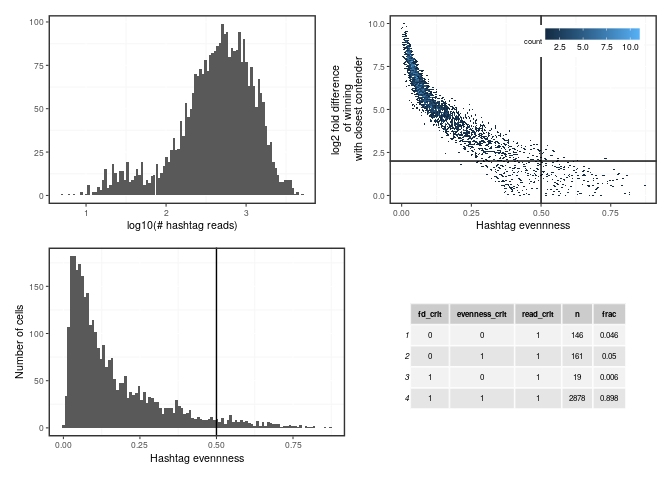
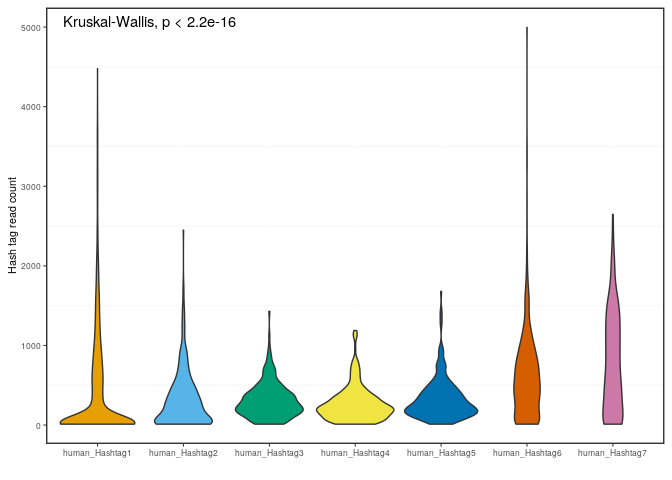
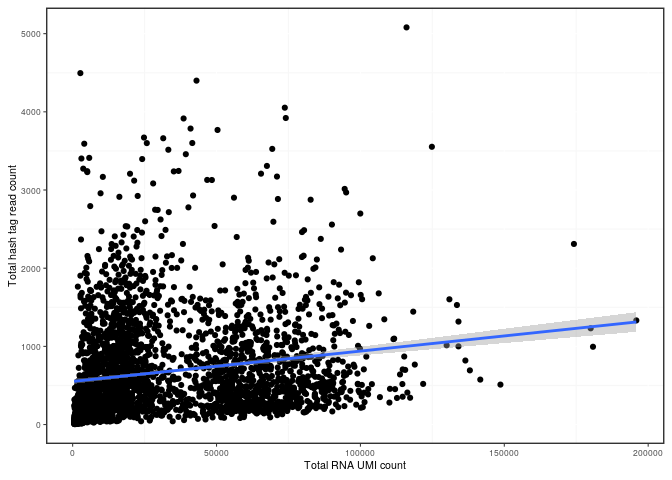

<!-- README.md is generated from README.Rmd. Please edit that file -->

# hashtagassignment

<!-- badges: start -->
<!-- badges: end -->

In 10x and other single cell sequencing technologies, antibody barcodes
are routinely added to cells before sequencing in order to multiplex
multiple experiments in a single sequencing run. Existing hash tag
assignment strategies (e.g. `HTODemux`) implicitly assume total hash tag
read counts to be identical between cells, but this assumption is false.
We observed a strong correlation between the total hash tag read counts
and the number of unique UMIs. The strategy presented here therefore
doesn’t use hashtag thresholds that are shared across cells, but rather
determines the most likely hashtag on a per cell basis. It removes
doublets and low confident cells by thresholding on i) the log2 ratio of
the maximal hash tag’s read count with the second best hash tag ii) the
‘evenness’ (normalized entropy) of hash tag counts and iii) the total
number of reads assigned to hash tags. The second metric will be low if
one hash tag clearly is the winner and higher if reads are more evenly
distributed across hash tags.

This repo is an extremely premature and developmental stadium. Its name
and interface is likely to change in the future, if we continue
development.

## Installation

``` r
if (!require('hashtagassignment')) {
  # install.packages("devtools")
  # devtools::install("~/libs/hashtagassignment")
  devtools::install_github("slagtermaarten/hashtagassignment")
}
library(hashtagassignment)
```

## Example usage

``` r
library(dplyr)
data_dir <- '/DATA/users/m.slagter/MirjamHoekstra/raw_exp_5310'
hashtag_counts <- extract_hashtags_from_cellranger(data_dir = data_dir)

## Define thresholds
## Cells need the winning hash tag to be at least 2^2 (=4) times larger than the
## second best hash hag
fd_thresh = 2
## Cells can have a hashtag evenness of at most .5
evenness_thresh = .5
## Minimal amount of hash tag reads cells need to have
read_thresh = 0
stats <- compute_hashtag_stats(hashtag_counts, 
                               fd_thresh = fd_thresh,
                               evenness_thresh = evenness_thresh, 
                               read_thresh = read_thresh)

## Filter for cells that do meet all of the criteria 
if (exists('seurat_object')) {
  # seurat_object <- load_seurat('exp5310')
  # rownames(seurat_object@meta.data) <- 
  #   names(seurat_object@active.ident) <-
  #   gsub('5310_', '', rownames(seurat_object@meta.data))
  filtered_seurat_object <- filter_seurat_stats(seurat_object, stats)
}
```

Select cells to serve as examples for different levels of evenness (\[0,
.1, .2, …\]). Notice how the distributions get more fuzzy as evenness
increases.

``` r
max_evenness <- floor(max(stats$hashtag_evenness) * 10) / 10

hashtag_evenness_examples <- purrr::map_dfr(seq(0, max_evenness, by = .1), 
                                            function(e) {
  idx <- order((stats$hashtag_evenness - e)^2)[1:2]
  stats %>%
    { .[idx, ] } %>%
    dplyr::select(sample_id, 
                  matches('HTO|human_Hashtag'), hashtag_evenness, fd_cc)
  }) %>% 
  unique %>% 
  dplyr::rename_with(.fn = function(x) gsub('(HTO\\d+)_.*', '\\1', x)) %>%
  dplyr::rename_with(.fn = function(x) gsub('human_Hashtag', 'HTO', x)) %>%
  dplyr::mutate(hashtag_evenness = round(hashtag_evenness, 2)) %>%
  dplyr::mutate(fd_cc = round(fd_cc, 2)) %>%
  { . }

hashtag_evenness_examples$selected <-
  with(hashtag_evenness_examples, 
       is.na(fd_cc) | fd_cc >= fd_thresh,
       hashtag_evenness <= evenness_thresh)
knitr::kable(hashtag_evenness_examples)
```

| sample\_id       | HTO1 | HTO2 | HTO3 | HTO4 | HTO5 | HTO6 | HTO7 | hashtag\_evenness | fd\_cc | selected |
|:-----------------|-----:|-----:|-----:|-----:|-----:|-----:|-----:|------------------:|-------:|:---------|
| AGCGTCGGTACCGTCG |   25 |    0 |    0 |    0 |    0 |    0 |    0 |              0.00 |     NA | TRUE     |
| TTGCGTCGTACTCGAT |  187 |    0 |    0 |    0 |    0 |    0 |    0 |              0.00 |     NA | TRUE     |
| CATGCGGTCCGTCCTA |   10 |    3 |    1 |    0 |    4 |  565 |    2 |              0.10 |   5.69 | TRUE     |
| GGATCTACATTCACAG |   14 |    2 |    0 |    3 |    0 |  511 |    1 |              0.10 |   5.09 | TRUE     |
| AGGGAGTGTTCATCGA |   20 |    4 |    0 |    1 |    2 |  298 |    2 |              0.20 |   3.83 | TRUE     |
| GTGGTTAGTGAGTAAT |   10 |   12 |  407 |    1 |    2 |    5 |    4 |              0.20 |   4.97 | TRUE     |
| GATCGTAGTCGCTTGG |  109 |    1 |    1 |    3 |    1 |   14 |    0 |              0.30 |   2.87 | TRUE     |
| CACAGATTCAACTGGT |   47 |    4 |  391 |    2 |    9 |    6 |    1 |              0.30 |   3.03 | TRUE     |
| GATTGGTAGAACTCCT |   56 |    4 |    1 |  169 |    0 |    1 |    5 |              0.40 |   1.58 | FALSE    |
| ATGTCTTCACGTATAC |    7 |    3 |    1 |    0 |    0 |    0 |   33 |              0.40 |   2.09 | TRUE     |
| ATCGTAGAGAGCAGCT |   13 |    4 |    1 |   85 |    3 |    6 |    3 |              0.50 |   2.62 | TRUE     |
| TTTACTGCAACTGTGT |    6 |    3 |    0 |    3 |    1 |    0 |   31 |              0.50 |   2.19 | TRUE     |
| GTGCTGGCAGATGCGA |    6 |    0 |    1 |    0 |    2 |    2 |    0 |              0.60 |   1.22 | FALSE    |
| TTGATGGTCCATCGTC |  104 |    3 |   26 |    4 |  131 |    9 |    0 |              0.60 |   0.33 | FALSE    |
| ATCTTCAGTGGTACAG |   12 |    9 |    0 |    1 |    1 |    4 |    1 |              0.70 |   0.38 | FALSE    |
| AGGCCACAGTACAACA |    5 |    1 |    0 |    1 |    2 |    1 |    0 |              0.70 |   1.00 | FALSE    |
| CGAGTTACAGAACTCT |   21 |   17 |    2 |   19 |    1 |   11 |    1 |              0.80 |   0.14 | FALSE    |
| TCAAGCAAGAAACCAT |    7 |    2 |    0 |    1 |    1 |    3 |    2 |              0.79 |   1.00 | FALSE    |

Create panel of plots to assess what kind and how many cells will be
filtered out

``` r
library(gridExtra)
library(ggplot2)
library(patchwork)

p1 <- stats$total_hashtag_reads %>% log10 %>% 
  qplot(bins = 100) + xlab('log10(# hashtag reads)')

p2 <- ggplot(mapping = aes(x = hashtag_evenness, y = fd_cc),
             data = stats) +
  geom_hex(bins = 150) +
  xlab('Hashtag evennness') +
  geom_hline(yintercept = fd_thresh) +
  geom_vline(xintercept = evenness_thresh) +
  ylab('log2 fold difference\n of winning\n with closest contender') +
  ggplot2::theme(legend.position = c(.95, .95), legend.justification = c(1, 1))

p4 <- ggplot(mapping = aes(x = hashtag_evenness), data = stats) +
  geom_histogram(bins = 100) +
  geom_vline(xintercept = evenness_thresh) +
  xlab('Hashtag evennness') +
  ylab('Number of cells')

p5 <- stats %>%
  dplyr::group_by(fd_crit, evenness_crit, read_crit) %>%
  dplyr::count() %>%
  dplyr::mutate(frac = round(n / nrow(stats), 3)) %>%
  gridExtra::tableGrob(theme = gridExtra::ttheme_default(base_size = 6))

(p1 + p2) / (p4 + p5) 
```

<!-- -->

# Comparison with HTODemux

``` r
seurat_object <- load_seurat('exp5310', appendix = '')
hashtag_counts <- extract_hashtags_from_cellranger(data_dir = data_dir)
seurat_object <- RenameCells(seurat_object, 
                             old.names = rownames(seurat_object@meta.data),
                             new.names = gsub('5310_', '', rownames(seurat_object@meta.data)))
shared_cells <- intersect(colnames(seurat_object), colnames(hashtag_counts))
seurat_object <- seurat_object[, shared_cells]
hashtag_counts <- hashtag_counts[, shared_cells]
```

``` r
seurat_object[['HTO']] <- CreateAssayObject(counts = hashtag_counts)
seurat_object <- NormalizeData(seurat_object, 
                               assay = 'HTO', normalization.method = 'CLR')
seurat_object <- HTODemux(seurat_object, assay = 'HTO', positive.quantile = 0.99)
table(seurat_object$HTO_classification.global)
```

    ## 
    ##  Doublet Negative  Singlet 
    ##      340      236     2380

``` r
HTO_class <- seurat_object@meta.data %>%
  dplyr::select(HTO_classification, HTO_classification.global, nCount_RNA) %>%
  rownames_to_column('sample_id')

merged_stats <- stats %>%
  inner_join(HTO_class, by = 'sample_id')
```

Tally of cells deemed fit by `HTODemux` and/or `hashtagassignment`. For
this dataset, `hashtagassignment` ‘loses’ 102 cells and ‘gains’ 365 as
compared to `HTODemux`. Thus, 263/3204 more cells remain for further
analysis with `hashtagassignment`.

``` r
merged_stats %>%
  dplyr::select(all_crit, HTO_classification.global) %>%
  dplyr::mutate(HTODemux = HTO_classification.global == 'Singlet') %>%
  dplyr::rename(hashtagassignment = all_crit) %>%
  dplyr::group_by(hashtagassignment, HTODemux) %>%
  dplyr::summarize(N = n()) %>%
  knitr::kable()
```

| hashtagassignment | HTODemux |    N |
|:------------------|:---------|-----:|
| FALSE             | FALSE    |  211 |
| FALSE             | TRUE     |  102 |
| TRUE              | FALSE    |  365 |
| TRUE              | TRUE     | 2278 |

Three examples of cells that are labeled as ‘Singlets’ by `HTODemux` but
deemed *unassignable* to a sample by `hashtagassignment`.

``` r
merged_stats %>%
  dplyr::filter(all_crit == FALSE & HTO_classification.global == 'Singlet') %>%
  dplyr::sample_n(3) %>%
  knitr::kable()
```

| sample\_id       | fd\_cc | hashtag\_evenness | dominant\_hashtag | total\_hashtag\_reads | human\_Hashtag1 | human\_Hashtag2 | human\_Hashtag3 | human\_Hashtag4 | human\_Hashtag5 | human\_Hashtag6 | human\_Hashtag7 | fd\_crit | evenness\_crit | read\_crit | all\_crit | HTO\_classification | HTO\_classification.global | nCount\_RNA |
|:-----------------|-------:|------------------:|------------------:|----------------------:|----------------:|----------------:|----------------:|----------------:|----------------:|----------------:|----------------:|:---------|:---------------|:-----------|:----------|:--------------------|:---------------------------|------------:|
| GTGTAACGTCTTACTT |  2.277 |             0.534 |                 5 |                    88 |              12 |               2 |               1 |               2 |              62 |               6 |               3 | TRUE     | FALSE          | TRUE       | FALSE     | human-Hashtag5      | Singlet                    |        7136 |
| CGGAATTTCCAAGCCG |  0.830 |             0.611 |                 1 |                    28 |              15 |               1 |               2 |               8 |               0 |               2 |               0 | FALSE    | FALSE          | TRUE       | FALSE     | human-Hashtag4      | Singlet                    |        5079 |
| AAACGAATCTTGCAGA |  0.138 |             0.646 |                 1 |                    24 |              10 |               3 |               0 |               1 |               9 |               1 |               0 | FALSE    | FALSE          | TRUE       | FALSE     | human-Hashtag5      | Singlet                    |        2335 |

Three examples of cells that are not labeled as ‘Singlets’ by `HTODemux`
but deemed *assignable* to a sample by `hashtagassignment`.

``` r
merged_stats %>%
  dplyr::filter(all_crit == TRUE & HTO_classification.global != 'Singlet') %>%
  dplyr::sample_n(3) %>%
  knitr::kable()
```

| sample\_id       | fd\_cc | hashtag\_evenness | dominant\_hashtag | total\_hashtag\_reads | human\_Hashtag1 | human\_Hashtag2 | human\_Hashtag3 | human\_Hashtag4 | human\_Hashtag5 | human\_Hashtag6 | human\_Hashtag7 | fd\_crit | evenness\_crit | read\_crit | all\_crit | HTO\_classification            | HTO\_classification.global | nCount\_RNA |
|:-----------------|-------:|------------------:|------------------:|----------------------:|----------------:|----------------:|----------------:|----------------:|----------------:|----------------:|----------------:|:---------|:---------------|:-----------|:----------|:-------------------------------|:---------------------------|------------:|
| TCCATCGAGTTGGACG |   5.53 |             0.190 |                 5 |                   497 |               9 |               9 |               9 |               2 |             462 |               4 |               2 | TRUE     | TRUE           | TRUE       | TRUE      | human-Hashtag3\_human-Hashtag5 | Doublet                    |       82089 |
| TAACACGAGTTGTAAG |   5.09 |             0.187 |                 1 |                    72 |              67 |               1 |               1 |               1 |               1 |               0 |               1 | TRUE     | TRUE           | TRUE       | TRUE      | Negative                       | Negative                   |         957 |
| GAGCCTGTCCGTCAAA |   2.29 |             0.370 |                 3 |                   553 |              88 |               1 |             433 |               6 |              18 |               3 |               4 | TRUE     | TRUE           | TRUE       | TRUE      | human-Hashtag3\_human-Hashtag5 | Doublet                    |       78372 |

# Choosing between two evils

`HTODemux` is appropriate when the major and only factor driving hash
tag reads is intrinsic to the hash tags: some barcode antibodies might
be more easily read-off than others (for instance due to GC-content
differences between their barcodes). The current `hashtagassignment`
library rather currently assumes no such intrinsic differences but
rather assumes hash tag read counts to be primarily driven by an
extrinsic, cell-specific factors that determine the total amount of hash
tag reads, which in turn is related to the total amount of detected UMIs
per cell. This factor could be explained by the amount of reagents
available to the single cell in the droplet or the cell’s overall state
of ‘happiness’.

Looking at hash tag count distributions in our dataset, there indeed
seem to be readability differences between hash tags: some hash tags are
higher in read counts than others. This argues for `HTODemux`’s
approach.

``` r
as.data.frame(t(hashtag_counts)) %>%
  reshape2::melt() %>%
  dplyr::filter(value > 10) %>%
  ggplot(aes(x = variable, y = value, fill = variable)) + 
    geom_violin() +
    ggpubr::stat_compare_means() +
    ylab('Hash tag read count') +
    xlab('') +
    guides(fill = 'none')
```

<!-- -->

There is, however, a relationship between the amount of detected UMIs
and total hash tag reads, arguing that cell intrinsic factors also play
a role. `HTODemux` currently does not consider this source of bias and
could benefit from doing so. In conclusion, neither strategy seems
optimal currently.

``` r
ggplot(merged_stats, aes(x = nCount_RNA, y = total_hashtag_reads)) + 
  geom_point() +
  geom_smooth(method = 'lm') +
  ylab('Total hash tag read count') +
  xlab('Total RNA UMI count')
```

<!-- -->
